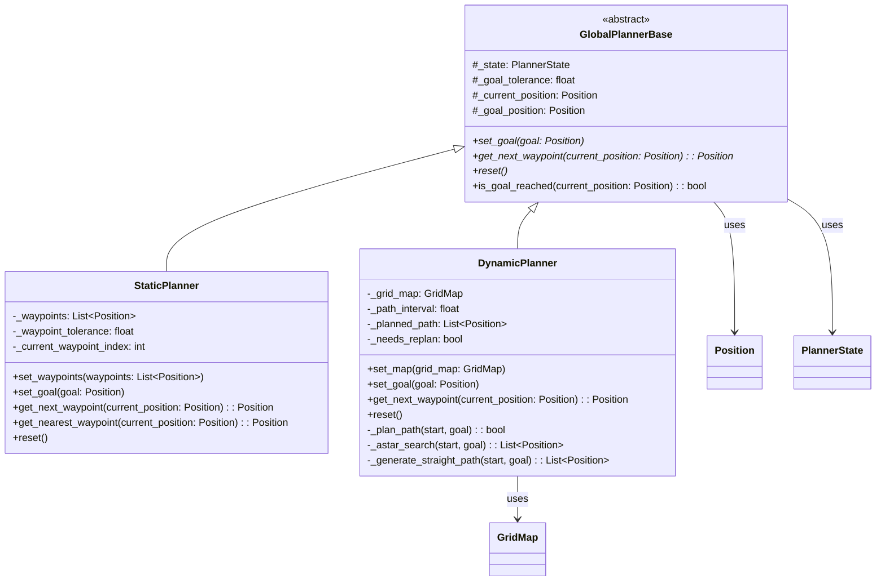
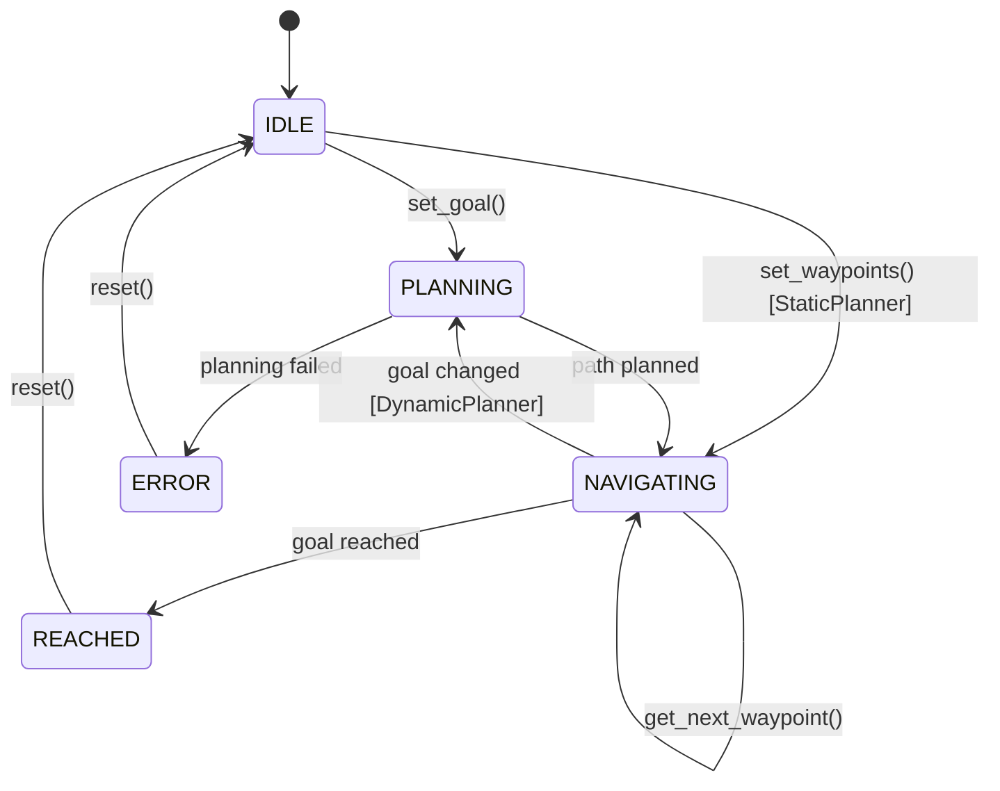
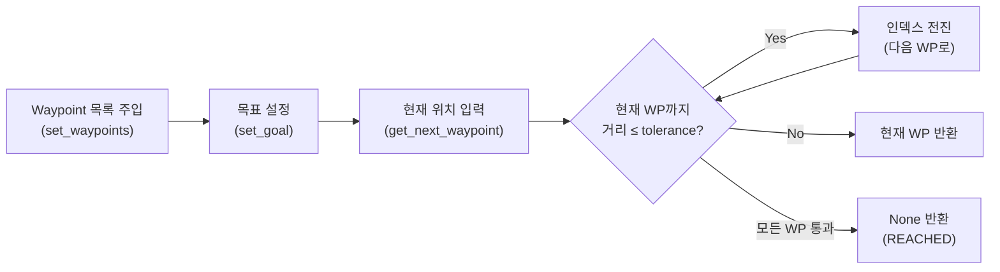
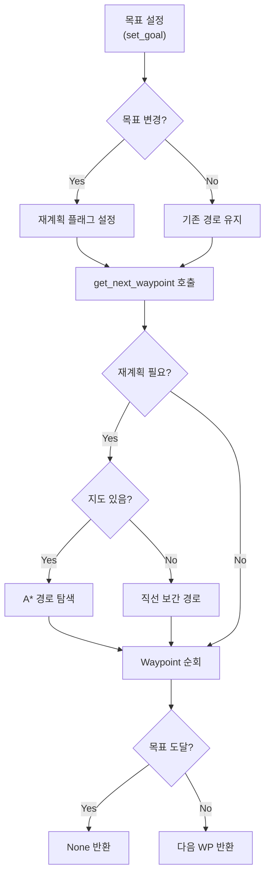

# Global Path Planner 모듈

> **파일**: [`global_planner.py`](file:///Users/byunghunhwang/dev/flame_robotics_patroller/python/plugins/base/global_planner.py)  
> **경로**: `python/plugins/base/global_planner.py`  
> **최종 수정**: 2026-07-14

---

## 개요

`global_planner.py`는 FLAME Robotics Patroller 프로젝트의 **전역 경로계획 알고리즘 표준 인터페이스**를 정의하는 모듈입니다.

추상 기본 클래스(`GlobalPlannerBase`)를 통해 일관된 인터페이스를 제공하며, 이를 상속받아 다양한 경로계획 전략을 구현할 수 있습니다. 현재 두 가지 구체 구현을 포함합니다:

| 클래스 | 설명 | 경로 생성 방식 |
|--------|------|---------------|
| **StaticPlanner** | 사전 정의 Waypoint 기반 | 외부에서 모든 Waypoint를 사전 주입 |
| **DynamicPlanner** | 동적 경로 생성 기반 | 목표 좌표만으로 A* 또는 직선 보간 경로 자동 생성 |

---

## 아키텍처



---

## 데이터 클래스

### Position

2D 좌표를 표현하는 데이터 클래스입니다. 모든 좌표는 **미터(m)** 단위입니다.

```python
@dataclass
class Position:
    x: float = 0.0  # x좌표 (미터)
    y: float = 0.0  # y좌표 (미터)
```

| 메서드 | 설명 |
|--------|------|
| `distance_to(other)` | 두 좌표 간 유클리드 거리 (미터) 계산 |
| `__eq__` | 1e-6 오차 허용 동등 비교 (`math.isclose`) |
| `__hash__` | 소수점 6자리 반올림 기반 해시 (딕셔너리 키로 사용 가능) |

### PlannerState

플래너의 운용 상태를 표현하는 열거형입니다.

| 상태 | 설명 |
|------|------|
| `IDLE` | 목표 미설정 상태 |
| `PLANNING` | 경로 계산 중 |
| `NAVIGATING` | 경로 추종 중 |
| `REACHED` | 목표 도달 |
| `ERROR` | 오류 발생 (경로 생성 실패 등) |



### GridMap

DynamicPlanner에서 사용하는 2D 점유 격자 지도입니다.

```python
@dataclass
class GridMap:
    width: int          # 열 수 (columns)
    height: int         # 행 수 (rows)
    resolution: float   # 셀 크기 (미터)
    origin_x: float     # 격자 원점의 월드 x좌표
    origin_y: float     # 격자 원점의 월드 y좌표
    grid: List[List[int]]  # 점유 격자 (0=free, 1=obstacle)
```

| 메서드 | 설명 |
|--------|------|
| `world_to_grid(position)` | 월드 좌표 → 격자 인덱스 `(row, col)` 변환 |
| `grid_to_world(row, col)` | 격자 인덱스 → 월드 좌표 (셀 중심) 변환 |
| `is_valid(row, col)` | 격자 경계 내 유효성 검사 |
| `is_free(row, col)` | 해당 셀이 장애물이 아닌지 확인 |
| `set_obstacle(row, col)` | 장애물 마킹 |
| `clear_obstacle(row, col)` | 장애물 해제 |

> [!NOTE]
> `grid`를 명시적으로 제공하지 않으면, 모든 셀이 `0`(free)으로 초기화된 빈 격자가 자동 생성됩니다.

---

## GlobalPlannerBase (추상 기본 클래스)

모든 전역 경로계획 알고리즘이 구현해야 할 **표준 인터페이스**를 정의합니다.

### 생성자 파라미터

| 파라미터 | 타입 | 기본값 | 설명 |
|----------|------|--------|------|
| `goal_tolerance` | `float` | `1.0` | 목표 도달 판정 거리 (미터) |

### 추상 메서드 (서브클래스에서 반드시 구현)

| 메서드 | 시그니처 | 설명 |
|--------|----------|------|
| `set_goal` | `(goal: Position) → None` | 네비게이션 목표 설정 |
| `get_next_waypoint` | `(current_position: Position) → Optional[Position]` | 현재 위치 기반 다음 Waypoint 반환 |
| `reset` | `() → None` | 플래너 초기 상태로 리셋 |

### 공통 메서드

| 메서드 | 시그니처 | 설명 |
|--------|----------|------|
| `is_goal_reached` | `(current_position: Position) → bool` | 현재 위치가 목표 허용 범위 내인지 확인 |

### 커스텀 플래너 확장 방법

```python
from global_planner import GlobalPlannerBase, Position

class MyCustomPlanner(GlobalPlannerBase):
    def set_goal(self, goal: Position) -> None:
        self._goal_position = goal
        # 커스텀 목표 설정 로직

    def get_next_waypoint(self, current_position: Position) -> Optional[Position]:
        # 커스텀 Waypoint 선택 로직
        ...

    def reset(self) -> None:
        self._goal_position = None
        self._state = PlannerState.IDLE
```

---

## StaticPlanner

### 개념

사전에 **모든 Waypoint를 순서대로 주입**받고, 로봇의 현재 위치를 기반으로 **미터 단위 거리 판정**을 통해 가장 적절한 다음 Waypoint를 반환합니다.



### 생성자 파라미터

| 파라미터 | 타입 | 기본값 | 설명 |
|----------|------|--------|------|
| `goal_tolerance` | `float` | `1.0` | 최종 목표 도달 판정 거리 (미터) |
| `waypoint_tolerance` | `float` | `2.0` | 개별 Waypoint 도달 판정 거리 (미터) |

### 주요 메서드

#### `set_waypoints(waypoints: List[Position]) → None`

Waypoint 시퀀스를 설정합니다. 기존 Waypoint를 대체하고 인덱스를 초기화합니다.

```python
planner.set_waypoints([
    Position(0, 0),
    Position(5, 0),
    Position(10, 0),
    Position(15, 5),
    Position(20, 10),
])
```

> [!IMPORTANT]
> 빈 리스트를 전달하면 `ValueError`가 발생합니다.

#### `set_goal(goal: Position) → None`

최종 목표를 설정합니다. Waypoint 목록의 마지막 좌표와 다른 경우, 목표가 Waypoint 목록 끝에 자동 추가됩니다.

#### `get_next_waypoint(current_position: Position) → Optional[Position]`

현재 위치를 기반으로 다음 Waypoint를 반환합니다.

**Waypoint 선택 로직:**

1. 최종 목표 도달 여부 확인 → 도달 시 `None` 반환
2. 현재 대상 Waypoint까지 거리가 `waypoint_tolerance` 이내이면 인덱스를 전진
3. 연속으로 tolerance 내에 있는 Waypoint를 모두 스킵 (고속 이동 대응)
4. 현재 대상 Waypoint 반환

**반환값:**
- `Position`: 다음 목표 Waypoint
- `None`: 모든 Waypoint를 통과했거나, 목표에 도달했거나, Waypoint가 없는 경우

#### `get_nearest_waypoint(current_position: Position) → Optional[Position]`

잔여 Waypoint 중 현재 위치에서 가장 가까운 Waypoint를 반환합니다. 인덱스를 변경하지 않는 조회 전용 메서드입니다.

### Properties

| Property | 타입 | 설명 |
|----------|------|------|
| `waypoints` | `List[Position]` | Waypoint 목록 (읽기 전용 복사본) |
| `current_waypoint_index` | `int` | 현재 대상 Waypoint 인덱스 |
| `remaining_waypoints` | `int` | 잔여 Waypoint 수 |
| `waypoint_tolerance` | `float` | Waypoint 도달 판정 거리 (get/set) |

### 사용 예제

```python
from global_planner import StaticPlanner, Position

# 1. 플래너 생성
planner = StaticPlanner(goal_tolerance=1.0, waypoint_tolerance=2.0)

# 2. Waypoint 설정 (출발지 → 목표지까지 모든 경유점)
waypoints = [
    Position(0, 0),
    Position(5, 0),
    Position(10, 0),
    Position(15, 5),
    Position(20, 10),
]
planner.set_waypoints(waypoints)
planner.set_goal(Position(20, 10))

# 3. 네비게이션 루프
while True:
    current_pos = get_robot_position()  # 로봇 현재 위치 획득
    next_wp = planner.get_next_waypoint(current_pos)

    if next_wp is None:
        print(f"목표 도달! 상태: {planner.state}")
        break

    print(f"다음 Waypoint: {next_wp}, 잔여: {planner.remaining_waypoints}")
    navigate_to(next_wp)  # 로봇에게 이동 명령
```

---

## DynamicPlanner

### 개념

**목표 위치만 설정**하면 전역 경로를 자동 생성합니다. 중간 Waypoint는 내부적으로 계획됩니다.

- **지도가 있는 경우**: A* 알고리즘으로 장애물을 회피하는 최적 경로 생성
- **지도가 없는 경우**: 오픈 공간으로 인식하여 직선 보간 경로 생성
- **목표 변경 시**: 자동으로 전역 경로를 재생성



### 생성자 파라미터

| 파라미터 | 타입 | 기본값 | 설명 |
|----------|------|--------|------|
| `goal_tolerance` | `float` | `1.0` | 목표 도달 판정 거리 (미터) |
| `waypoint_tolerance` | `float` | `2.0` | 생성된 Waypoint 도달 판정 거리 (미터) |
| `grid_map` | `Optional[GridMap]` | `None` | 점유 격자 지도 (`None`이면 오픈 공간) |
| `path_interval` | `float` | `2.0` | 오픈 공간 모드에서 Waypoint 간격 (미터) |

### 주요 메서드

#### `set_goal(goal: Position) → None`

목표를 설정하거나 변경합니다. 이전 목표와 다르면 재계획 플래그가 설정되며, 다음 `get_next_waypoint()` 호출 시 경로가 재생성됩니다.

> [!NOTE]
> 동일한 목표를 다시 설정하면 재계획이 발생하지 않습니다.

#### `set_map(grid_map: GridMap) → None`

지도를 설정하거나 업데이트합니다. 목표가 이미 설정된 상태에서 지도가 변경되면 재계획이 트리거됩니다.

#### `get_next_waypoint(current_position: Position) → Optional[Position]`

현재 위치 기반으로 다음 Waypoint를 반환합니다. 재계획이 필요한 경우 내부적으로 경로를 먼저 생성합니다.

**반환값:**
- `Position`: 다음 목표 Waypoint
- `None`: 목표 도달, 목표 미설정, 또는 경로 생성 실패

### Properties

| Property | 타입 | 설명 |
|----------|------|------|
| `grid_map` | `Optional[GridMap]` | 현재 지도 |
| `planned_path` | `List[Position]` | 계획된 경로 (읽기 전용 복사본) |
| `remaining_waypoints` | `int` | 잔여 Waypoint 수 |

### 경로 생성 알고리즘

#### 오픈 공간 모드 (지도 없음)

출발지에서 목표까지 **직선 보간**으로 등간격 Waypoint를 생성합니다.

```
path_interval = 5.0m
Start(0,0) ──5m──> WP1(5,0) ──5m──> WP2(10,0) ──5m──> WP3(15,0) ──5m──> Goal(20,0)
```

- Waypoint 간격: `path_interval` 파라미터로 제어
- 총 거리가 `path_interval` 미만이면 목표 좌표 하나만 반환

#### A* 탐색 모드 (지도 있음)

`GridMap` 위에서 **A* 알고리즘**을 사용하여 장애물을 회피하는 최적 경로를 탐색합니다.

| 항목 | 상세 |
|------|------|
| **이동 방향** | 8방향 (상하좌우 + 대각선) |
| **이동 비용** | 직선 1.0 × resolution, 대각선 √2 × resolution |
| **휴리스틱** | Octile Distance (8방향 최적 추정) |
| **경로 단순화** | 직선 구간의 중간점 제거 (Collinear Simplification) |
| **출발지 보정** | 출발 셀이 장애물인 경우 BFS로 가장 가까운 빈 셀 탐색 |

### 사용 예제

#### 오픈 공간 (지도 없음)

```python
from global_planner import DynamicPlanner, Position

planner = DynamicPlanner(
    goal_tolerance=1.0,
    waypoint_tolerance=2.0,
    path_interval=5.0
)

# 목표 설정
planner.set_goal(Position(50, 30))

# 네비게이션 루프
current = Position(0, 0)
while True:
    wp = planner.get_next_waypoint(current)
    if wp is None:
        print("목표 도달!")
        break
    print(f"다음: {wp}")
    current = wp  # 시뮬레이션: 바로 이동

# 목표 변경 (자동 재계획)
planner.set_goal(Position(100, 0))
wp = planner.get_next_waypoint(Position(50, 30))  # 새 경로 생성됨
```

#### 지도 기반 (A* 경로 탐색)

```python
from global_planner import DynamicPlanner, GridMap, Position

# 20x20 격자 지도 생성 (셀 크기 1m)
grid_map = GridMap(width=20, height=20, resolution=1.0)

# 장애물 벽 추가 (row 5~14, col 10)
for r in range(5, 15):
    grid_map.set_obstacle(r, 10)

# 플래너 생성
planner = DynamicPlanner(
    goal_tolerance=1.0,
    waypoint_tolerance=1.5,
    grid_map=grid_map
)

# 목표 설정 및 경로 탐색
planner.set_goal(Position(15.5, 10.5))

wp = planner.get_next_waypoint(Position(5.5, 10.5))
print(f"다음 Waypoint: {wp}")
print(f"전체 경로: {planner.planned_path}")

# 지도 업데이트 시 자동 재계획
grid_map.clear_obstacle(10, 10)  # 벽 일부 제거
planner.set_map(grid_map)        # 지도 갱신 → 재계획 트리거
```

---

## tolerance 파라미터 가이드

두 tolerance 파라미터는 Waypoint 전환과 목표 도달 판정에 핵심적인 역할을 합니다.

```
                    waypoint_tolerance                    goal_tolerance
                    ◄──────────────►                      ◄────────────►

  Robot ──────────── ○ WP[n] ──────────── ○ WP[n+1] ──── ● Goal
                     │                    │               │
                     └─ 이 범위 내 진입 시  └─ 다음 WP로    └─ 도달 판정
                        현재 WP 통과 처리     자동 전진          → None 반환
```

| 파라미터 | 권장 범위 | 비고 |
|----------|-----------|------|
| `goal_tolerance` | 0.5 ~ 2.0m | GPS 정밀도, 로봇 크기에 따라 조정 |
| `waypoint_tolerance` | 1.0 ~ 5.0m | Waypoint 간격 대비 50% 이하 권장 |

> [!WARNING]
> `waypoint_tolerance`가 Waypoint 간격보다 크면 여러 Waypoint를 한 번에 건너뛸 수 있습니다. 의도치 않은 경로 이탈이 발생할 수 있으므로 Waypoint 간격 대비 적절한 값을 설정하세요.

---

## 전체 API 요약

### GlobalPlannerBase

| 구분 | 이름 | 시그니처 |
|------|------|----------|
| Property | `state` | `→ PlannerState` |
| Property | `goal_tolerance` | `→ float` (get/set) |
| Abstract | `set_goal` | `(goal: Position) → None` |
| Abstract | `get_next_waypoint` | `(current_position: Position) → Optional[Position]` |
| Abstract | `reset` | `() → None` |
| Method | `is_goal_reached` | `(current_position: Position) → bool` |

### StaticPlanner

| 구분 | 이름 | 시그니처 |
|------|------|----------|
| Property | `waypoints` | `→ List[Position]` (읽기 전용) |
| Property | `current_waypoint_index` | `→ int` |
| Property | `remaining_waypoints` | `→ int` |
| Property | `waypoint_tolerance` | `→ float` (get/set) |
| Method | `set_waypoints` | `(waypoints: List[Position]) → None` |
| Method | `set_goal` | `(goal: Position) → None` |
| Method | `get_next_waypoint` | `(current_position: Position) → Optional[Position]` |
| Method | `get_nearest_waypoint` | `(current_position: Position) → Optional[Position]` |
| Method | `reset` | `() → None` |

### DynamicPlanner

| 구분 | 이름 | 시그니처 |
|------|------|----------|
| Property | `grid_map` | `→ Optional[GridMap]` |
| Property | `planned_path` | `→ List[Position]` (읽기 전용) |
| Property | `remaining_waypoints` | `→ int` |
| Method | `set_map` | `(grid_map: GridMap) → None` |
| Method | `set_goal` | `(goal: Position) → None` |
| Method | `get_next_waypoint` | `(current_position: Position) → Optional[Position]` |
| Method | `reset` | `() → None` |

### GridMap

| 구분 | 이름 | 시그니처 |
|------|------|----------|
| Method | `world_to_grid` | `(position: Position) → Tuple[int, int]` |
| Method | `grid_to_world` | `(row: int, col: int) → Position` |
| Method | `is_valid` | `(row: int, col: int) → bool` |
| Method | `is_free` | `(row: int, col: int) → bool` |
| Method | `set_obstacle` | `(row: int, col: int) → None` |
| Method | `clear_obstacle` | `(row: int, col: int) → None` |
